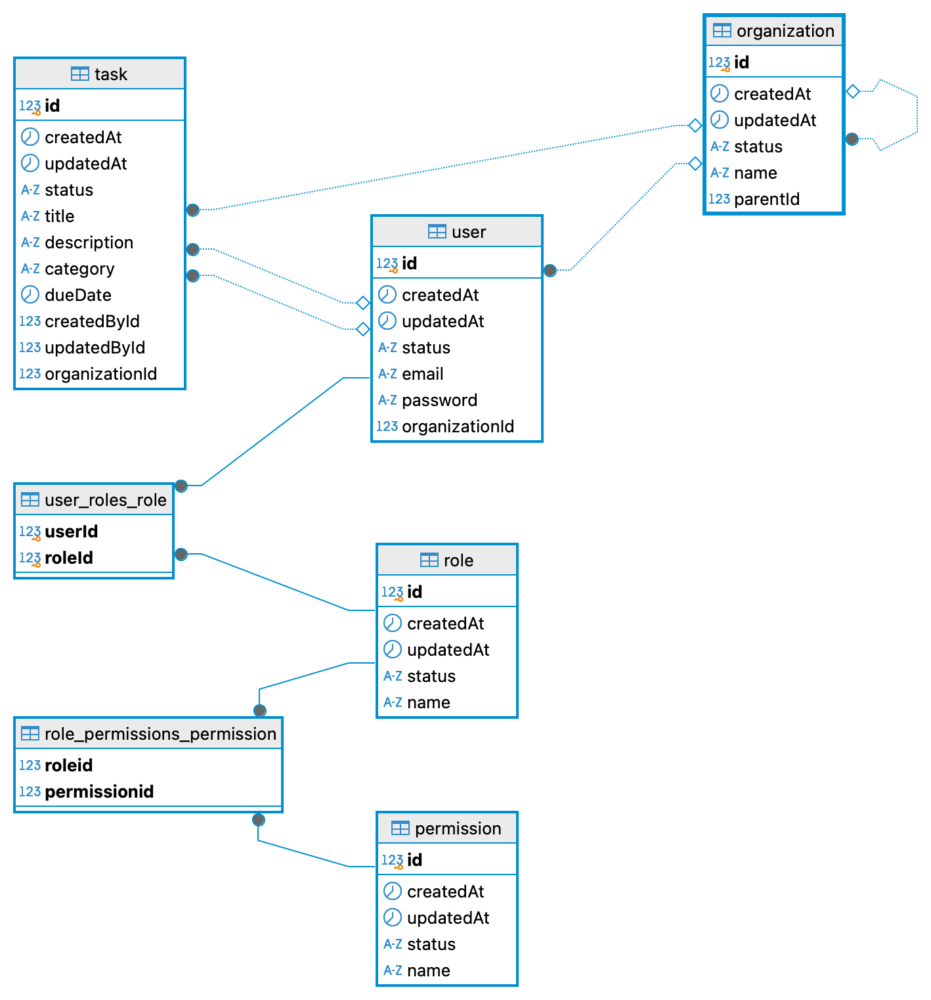

# Secure Task Management System

<a alt="Nx logo" href="http://localhost:4200" target="_blank" rel="noreferrer"></a>

## 📄 Setup Instructions

## Prerequisites

You do **not** need Node.js or Angular CLI installed locally if you use Docker as described below.

Ensure you have:

- **Docker:** v24.x or higher
- **Docker Compose:** v2.x or higher

For advanced/manual development (outside Docker), ensure you have:

- **Node.js:** v24.x or higher
- **Nx CLI:** v21.x or higher
- **NestJS:** v11.x or higher
- **Angular CLI:** v20.x or higher
- **Tailwind CSS:** v3.4.x or higher
- **Jest:** v29.7.x or higher

Check your versions with:

```bash
docker -v
docker compose version
node -v
nx --version
ng --version
nest --version
npx tailwindcss --version
npx jest --version
```

> **Note:** If using Docker for all development, these will be handled automatically inside containers.

### Environment Variables
Create a `.env` file in the project root by copying the example:
```bash
cp .env.example .env
```
Edit `.env` with your actual values. See `.env.example` for all required variables:
```env
# Database configuration
DB_TYPE=postgres
DB_PORT=5432
POSTGRES_HOST=localhost
POSTGRES_USER=taskuser
POSTGRES_PASSWORD=taskpassword
POSTGRES_DB=taskdb

# JWT configuration
JWT_SECRET=replace-with-a-strong-random-secret

# App port
PORT=3001
```

### Running the Apps
Start both backend (NestJS) and frontend (Angular) with Docker Compose:
```bash
docker-compose up --build
```
- **Frontend:** [http://localhost:4200/](http://localhost:4200/)
- **Backend API:** [http://localhost:3001/api](http://localhost:3001/api)

### Seeding the Database
After starting the app (so TypeORM has created all tables), run the SQL seed file to insert
initial permissions, roles, organizations, and users.

```bash
# Using Docker Compose – copy the file into the container, then execute it:
docker compose cp apps/api/src/seed/seed.sql tasks_db:/seed.sql
docker compose exec tasks_db psql -U taskuser -d taskdb -f /seed.sql

# Or directly with psql (PostgreSQL is exposed on host port 5435):
psql -h localhost -p 5435 -U taskuser -d taskdb \
     -f apps/api/src/seed/seed.sql
```

The script is idempotent – re-running it will not duplicate any rows.

Default credentials after seeding:

| Email | Password | Role |
|---|---|---|
| owner@example.com | OwnerPass123! | Owner (full access, all orgs) |
| admin@example.com | AdminPass123! | Admin (create/edit/delete tasks in org 1) |
| viewer@example.com | ViewerPass123! | Viewer (read-only, own org 2) |
| adminOther@example.com | AdminPass123! | Admin (create/edit/delete tasks in org 3) |

### Running Tests
```bash
# Backend tests
npx nx test api --no-coverage

# Frontend tests
npx nx test dashboard --no-coverage

# Or directly with Jest:
npx jest --config apps/api/jest.config.ts --no-coverage
```


## 🏗️ Architecture Overview

## Technology Stack

- **Angular** (frontend)
- **NestJS** (backend, REST API)
- **Nx Monorepo** (workspace orchestration)
- **Tailwind CSS** (styling for frontend)
- **Jest** (unit testing)
- **Docker & Docker Compose** (containerization)

### NX Monorepo Layout
- `apps/` contains:
  - `dashboard/` (Angular frontend)
  - `api/` (NestJS backend)
- `libs/` contains shared code (interfaces, utilities, etc.)

Nx helps manage dependencies, code sharing, and consistent tooling.

### Shared Libraries
- Common interfaces and utilities are in `libs/` and imported by both apps.


## Data Model Explanation

### Schema

There are the entities:

- **User**: id, email, password, roles (ManyToMany → Role), organization (ManyToOne → Organization)
- **Task**: id, title, description, category, taskStatus (todo/inprogress/done/archived), dueDate, createdBy (→ User), updatedBy (→ User), organization (→ Organization)
- **Organization**: id, name, parent (→ Organization, 2-level hierarchy), users
- **Role**: id, name (owner/admin/viewer), permissions (ManyToMany → Permission)
- **Permission**: id, name (e.g. task:create, audit:read)
- **AuditLog**: id, userId, userEmail, action, resource, resourceId, orgId, details, createdAt

### ERD Diagram




## Access Control Implementation

### Roles, Permissions, and Organization Hierarchy

Three roles are supported, with inherited permissions:

| Role | Permissions |
|---|---|
| **Owner** | Full access to all tasks and orgs; can view audit logs; can manage users |
| **Admin** | Create/read/update/delete tasks in their org; can view audit logs |
| **Viewer** | Read-only access to tasks in their org; can update/delete their own tasks |

**Organization hierarchy**: Organizations support a 2-level parent/child structure. Users belong to one organization.

**Task visibility scoping**:
- Owner: sees tasks across all organizations
- Admin/Viewer: sees only tasks within their organization

### JWT Auth Integration

- **JWT**: Generated on `/api/auth/login`. Includes `sub` (userId), `roles`, and `orgId` claims.
- **Roles source**: Roles are always fetched from the database at login — never trusted from the request body (prevents privilege escalation).
- **Guards**: All task endpoints use `@UseGuards(JwtAuthGuard, RolesGuard)`.
- **Role/Permission Checks**: The `@Roles()` decorator restricts endpoints by role; `RolesGuard` reads roles from the JWT payload.
- **Audit Logging**: Every task create/update/delete/view writes a record to the `AuditLog` table and logs to console.

### Security Design Decisions

1. **No body-trusting for roles**: The auth controller extracts roles exclusively from the DB result of `validateUser()`, eliminating the privilege escalation vulnerability present in the original code.
2. **RBAC at service layer**: Permission checks happen in `TaskService`, not just in decorators, providing defense-in-depth.
3. **Audit trail**: Every task operation is recorded with userId, email, action, resource, and timestamp.
4. **JWT claims**: The JWT payload carries `roles` and `orgId` so guards can make authorization decisions without additional DB lookups per request.


## API Documentation

### Endpoint List & Sample Request/Responses

The backend API is built with NestJS and exposes RESTful endpoints at `http://localhost:3001/api`.

**Authentication**

- `POST /api/auth/login`
  Authenticate with email and password. Returns a JWT access token.
  Example:
    - Request: `{ "email": "user@example.com", "password": "password" }`
    - Response: `{ "access_token": "..." }`

**Tasks**

- `GET /api/tasks`
  List tasks scoped by role and organization. Owner sees all; Admin/Viewer see their org only.
  Example:
    - Header: `Authorization: Bearer <token>`
    - Response: `[ { "id": 1, "title": "Task 1", "taskStatus": "todo", ... } ]`

- `GET /api/tasks/:id`
  Get a specific task by ID. Requires authentication.
  Example:
    - Header: `Authorization: Bearer <token>`
    - Params: `"id": 1`
    - Response: `{ "id": 1, "title": "Task 1", "taskStatus": "inprogress", ... }`

- `POST /api/tasks`
  Create a task. Requires Owner or Admin role.
  Example:
    - Header: `Authorization: Bearer <token>`
    - Body: `{ "title": "New Task", "category": "Work", "taskStatus": "todo" }`
    - Response: `{ "id": 2, "title": "New Task", "taskStatus": "todo", ... }`

- `PUT /api/tasks/:id`
  Update a task. Owners/Admins can update any task; Viewers can only update their own.
  Example:
    - Header: `Authorization: Bearer <token>`
    - Params: `"id": 2`
    - Body: `{ "taskStatus": "inprogress" }`
    - Response: `{ "id": 2, "taskStatus": "inprogress", ... }`

- `DELETE /api/tasks/:id`
  Delete a task. Owners/Admins can delete any task; Viewers can only delete their own.
  Example:
    - Header: `Authorization: Bearer <token>`
    - Params: `"id": 2`
    - Response: `{ "deleted": true }`

**Audit Log**

- `GET /api/audit-log`
  Retrieve all audit log entries. Restricted to Owner and Admin roles.
  Example:
    - Header: `Authorization: Bearer <owner-or-admin-token>`
    - Response: `[ { "id": 1, "userId": "1", "action": "CREATE_TASK", "resource": "task", "createdAt": "..." } ]`


## Future Considerations

### Advanced Role Delegation

- Support for hierarchical roles (delegation, role inheritance).
- Allow organization admins to delegate specific permissions.

### Production-Ready Security

- **JWT Refresh Tokens**: Implement for session longevity.
- **CSRF Protection**: Add CSRF tokens for frontend forms.
- **RBAC Caching**: Cache roles/permissions for efficient authorization checks.

### Scaling Permission Checks

- Use distributed caching (e.g., Redis) for permission data.
- Optimize DB queries for large organizations.

### 🚀 Production Deployment

For production, you may use nginx as a reverse proxy:
- Serve the Angular build (`dist/apps/dashboard`) as static files.
- Proxy `/api` requests to the NestJS backend.
- Benefits: Centralized routing, SSL, caching.

For development, direct port mapping via Docker Compose is sufficient.
